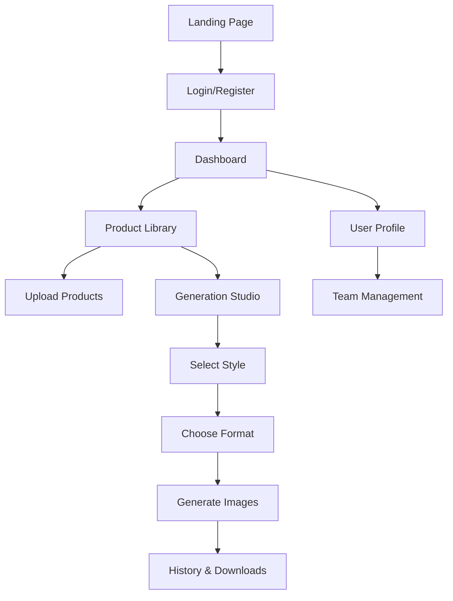

# MayaLens - Produktanforderungsdokument (PRD)

## 1. Produktübersicht

MayaLens ist ein revolutionäres KI-gestütztes Tool für Produktfotografie, das aus einfachen Produktbildern professionelle, verkaufsfördernde Fotoshooting-Bilder in unter 30 Sekunden generiert. Das Tool nutzt Gemini 2.5 Flash Image API und bietet eine kosteneffiziente Alternative zu traditioneller Produktfotografie ($0.039 pro Bild vs. €200+ Fotograf).

Zielgruppe: E-Commerce-Unternehmen, Online-Händler, Marketing-Agenturen und Produktdesigner, die hochwertige Produktbilder für verschiedene Formate und Plattformen benötigen.

## 2. Core Features

### 2.1 User Roles

| Role | Registrierungsmethode | Kernberechtigungen |
|------|----------------------|--------------------|
| Standard User | E-Mail-Registrierung | Produktupload, Bildgenerierung, Download |
| Team Admin | Team-Erstellung | Alle User-Rechte + Team-Management |
| Team Member | Einladung durch Admin | Standard User-Rechte innerhalb des Teams |

### 2.2 Feature Module

Unser MayaLens MVP besteht aus folgenden Hauptseiten:

1. **Landing Page**: Hero-Sektion mit Produktdemo, Feature-Übersicht, Preismodell
2. **Authentication Pages**: Login/Register mit JWT-basierter Authentifizierung
3. **Dashboard**: Übersicht über Generierungen, Statistiken, Quick Actions
4. **Product Library**: Produktverwaltung mit Upload, CRUD-Operationen, Kategorisierung
5. **Generation Studio**: KI-Bildgenerierung mit Style-Auswahl und Format-Optionen
6. **History & Downloads**: Generierungshistorie mit Download-Funktionalität
7. **User Profile**: Profilmanagement und Team-Einstellungen

### 2.3 Page Details

| Page Name | Module Name | Feature Description |
|-----------|-------------|--------------------|
| Landing Page | Hero Section | Animierte Produktdemo, Value Proposition, CTA-Buttons mit Glassmorphism-Design |
| Landing Page | Features Overview | Interaktive Feature-Cards mit Hover-Effekten, Before/After-Beispiele |
| Authentication | Login Form | E-Mail/Passwort-Login, "Remember Me", Passwort-Reset-Link |
| Authentication | Register Form | E-Mail-Registrierung, Passwort-Validierung, Terms & Conditions |
| Dashboard | Statistics Cards | Generierungsanzahl, Kosten-Übersicht, Erfolgsrate mit animierten Countern |
| Dashboard | Recent Activity | Letzte Generierungen mit Thumbnails, Quick-Actions (Download, Regenerate) |
| Product Library | Upload Zone | Drag & Drop-Interface, Multi-File-Upload, Fortschrittsanzeige |
| Product Library | Product Grid | Masonry-Layout mit Produktkarten, Hover-Effekte, Quick-Actions |
| Product Library | Product Management | CRUD-Operationen, Kategorisierung, Tagging, Bulk-Actions |
| Generation Studio | Image Preview | Split-Screen-Layout (Original vs. Generiert), Zoom-Funktionalität |
| Generation Studio | Style Selector | Visuelle Style-Cards (Studio, Lifestyle, Minimalist, Luxury) |
| Generation Studio | Format Options | Format-Auswahl (1:1, 9:16, 16:9, Original) mit Vorschau |
| Generation Studio | Generation Controls | Generate-Button, Fortschrittsanzeige, Batch-Processing |
| History & Downloads | Generation History | Chronologische Liste aller Generierungen mit Filter-Optionen |
| History & Downloads | Download Manager | Bulk-Download, Format-Konvertierung, Cloud-Export |
| User Profile | Profile Settings | Avatar-Upload, Name/E-Mail-Änderung, Passwort-Update |
| User Profile | Team Management | Team-Erstellung, Mitglieder-Einladung, Rollen-Verwaltung |

## 3. Core Process

### Standard User Flow
1. **Registrierung/Login** → Benutzer erstellt Account oder meldet sich an
2. **Produkt-Upload** → Upload von Produktbildern via Drag & Drop
3. **Style-Auswahl** → Auswahl des gewünschten Fotografie-Stils
4. **Format-Definition** → Bestimmung des Ausgabeformats
5. **KI-Generierung** → Automatische Bildgenerierung via Gemini API
6. **Review & Download** → Überprüfung und Download der generierten Bilder

### Team Admin Flow
1. **Team-Erstellung** → Einrichtung eines Team-Accounts
2. **Mitglieder-Einladung** → Einladung von Team-Mitgliedern
3. **Projekt-Management** → Überwachung von Team-Aktivitäten und Kosten
4. **Bulk-Operations** → Batch-Processing für mehrere Produkte

## 4. User Interface Design

### 4.1 Design Style

- **Primärfarben**: Gradient von #667eea zu #764ba2 (Hauptaktionen)
- **Sekundärfarben**: Gradient von #f093fb zu #f5576c (Akzente)
- **Button-Stil**: Glassmorphism mit backdrop-filter: blur(10px), abgerundete Ecken (20px)
- **Schriftarten**: Inter (Headlines), Source Sans Pro (Body Text), Größen: 14px-48px
- **Layout-Stil**: Card-basiert mit Glassmorphism-Effekten, Top-Navigation mit Sidebar
- **Icons**: Lucide React Icons mit konsistenter 24px Größe

### 4.2 Page Design Overview

| Page Name | Module Name | UI Elements |
|-----------|-------------|-------------|
| Landing Page | Hero Section | Gradient Background (#1e3c72 → #2a5298), Glassmorphism Cards, Framer Motion Animations |
| Dashboard | Statistics Cards | Glass Cards mit backdrop-blur, Animated Counters, Gradient Borders |
| Product Library | Upload Zone | Dashed Border Animation, Drag-over States, Progress Rings |
| Generation Studio | Style Selector | Hover-Effekte mit Transform Scale(1.02), Box-Shadow Elevation |
| History & Downloads | Generation Grid | Masonry Layout, Lazy Loading, Infinite Scroll |

### 4.3 Responsiveness

Mobile-first Responsive Design mit Breakpoints:
- Mobile: 320px-768px (Touch-optimiert)
- Tablet: 768px-1024px (Hybrid-Navigation)
- Desktop: 1024px+ (Full-Feature-Layout)

Touch-Interaktionen für mobile Geräte optimiert mit größeren Touch-Targets (44px minimum) und Swipe-Gesten für Navigation.