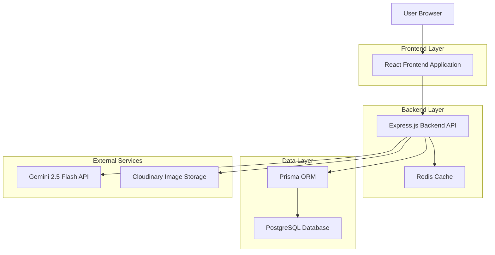
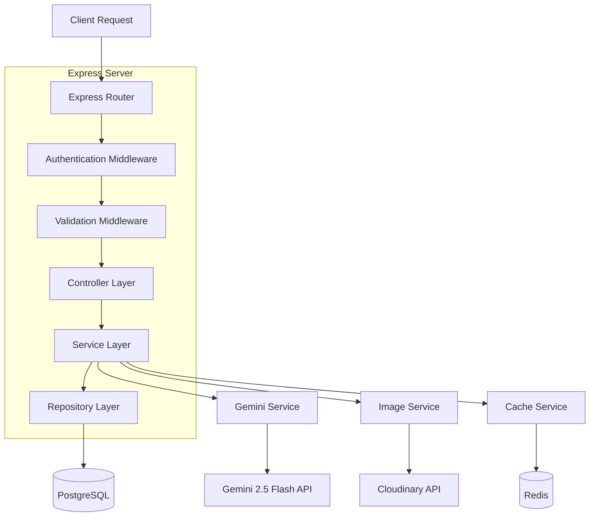
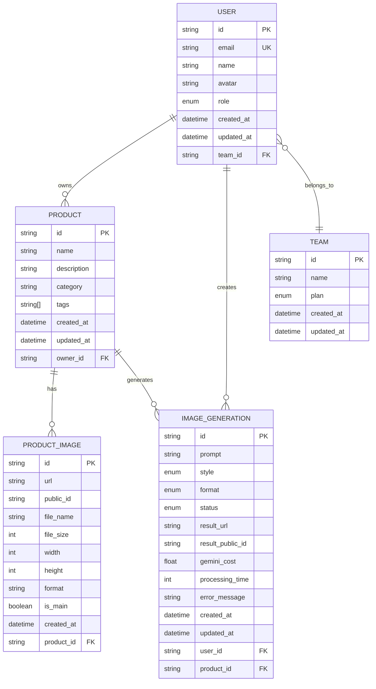

# MayaLens - Technische Architekturdokumentation

## 1. Architecture Design



## 2. Technology Description

* Frontend: React\@18 + TypeScript + Vite + TailwindCSS\@3 + Framer Motion + React Query

* Backend: Node.js\@20 + Express\@4 + TypeScript + Prisma + JWT + Multer + Sharp

* Database: PostgreSQL (via Railway)

* Cache: Redis (Session Management)

* External APIs: Gemini 2.5 Flash Image API + Cloudinary + Stripe

## 3. Route Definitions

| Route              | Purpose                                             |
| ------------------ | --------------------------------------------------- |
| /                  | Landing page mit Hero-Sektion und Feature-Übersicht |
| /login             | Benutzer-Anmeldung mit JWT-Authentifizierung        |
| /register          | Benutzer-Registrierung mit E-Mail-Validierung       |
| /dashboard         | Hauptdashboard mit Statistiken und Quick Actions    |
| /products          | Produktbibliothek mit Upload und Management         |
| /studio/:productId | Generierungsstudio für KI-Bildbearbeitung           |
| /history           | Generierungshistorie mit Download-Optionen          |
| /profile           | Benutzerprofil und Team-Management                  |
| /team              | Team-Verwaltung und Mitglieder-Einladungen          |

## 4. API Definitions

### 4.1 Core API

**Authentication Endpoints**

```
POST /api/auth/register
```

Request:

| Param Name | Param Type | isRequired | Description               |
| ---------- | ---------- | ---------- | ------------------------- |
| email      | string     | true       | Benutzer E-Mail-Adresse   |
| password   | string     | true       | Passwort (min. 8 Zeichen) |
| name       | string     | true       | Vollständiger Name        |

Response:

| Param Name | Param Type | Description            |
| ---------- | ---------- | ---------------------- |
| success    | boolean    | Registrierungsstatus   |
| user       | User       | Benutzerdaten          |
| tokens     | TokenPair  | Access & Refresh Token |

```
POST /api/auth/login
```

Request:

| Param Name | Param Type | isRequired | Description             |
| ---------- | ---------- | ---------- | ----------------------- |
| email      | string     | true       | Benutzer E-Mail-Adresse |
| password   | string     | true       | Benutzer-Passwort       |

Response:

| Param Name | Param Type | Description            |
| ---------- | ---------- | ---------------------- |
| success    | boolean    | Login-Status           |
| user       | User       | Benutzerdaten          |
| tokens     | TokenPair  | Access & Refresh Token |

**Product Management**

```
POST /api/products
```

Request:

| Param Name  | Param Type | isRequired | Description              |
| ----------- | ---------- | ---------- | ------------------------ |
| name        | string     | true       | Produktname              |
| description | string     | false      | Produktbeschreibung      |
| category    | string     | true       | Produktkategorie         |
| images      | File\[]    | true       | Produktbilder (max 10MB) |

Response:

| Param Name | Param Type | Description        |
| ---------- | ---------- | ------------------ |
| success    | boolean    | Upload-Status      |
| product    | Product    | Erstelltes Produkt |

**Image Generation**

```
POST /api/generate
```

Request:

| Param Name | Param Type      | isRequired | Description      |
| ---------- | --------------- | ---------- | ---------------- |
| productId  | string          | true       | Produkt-ID       |
| style      | GenerationStyle | true       | Generierungsstil |
| format     | ImageFormat     | true       | Ausgabeformat    |
| prompt     | string          | false      | Custom Prompt    |

Response:

| Param Name    | Param Type      | Description                 |
| ------------- | --------------- | --------------------------- |
| success       | boolean         | Generierungsstatus          |
| generation    | ImageGeneration | Generierungsdaten           |
| estimatedTime | number          | Geschätzte Bearbeitungszeit |

Example Request:

```json
{
  "productId": "clp123abc",
  "style": "PROFESSIONAL_STUDIO",
  "format": "SQUARE_1_1"
}
```

## 5. Server Architecture Diagram



## 6. Data Model

### 6.1 Data Model Definition



### 6.2 Data Definition Language

**User Table (users)**

```sql
-- Create table
CREATE TABLE users (
    id TEXT PRIMARY KEY DEFAULT gen_random_uuid()::text,
    email VARCHAR(255) UNIQUE NOT NULL,
    password_hash VARCHAR(255) NOT NULL,
    name VARCHAR(100) NOT NULL,
    avatar TEXT,
    role VARCHAR(20) DEFAULT 'USER' CHECK (role IN ('ADMIN', 'USER')),
    team_id TEXT,
    created_at TIMESTAMP WITH TIME ZONE DEFAULT NOW(),
    updated_at TIMESTAMP WITH TIME ZONE DEFAULT NOW()
);

-- Create indexes
CREATE INDEX idx_users_email ON users(email);
CREATE INDEX idx_users_team_id ON users(team_id);

-- Grant permissions
GRANT SELECT ON users TO anon;
GRANT ALL PRIVILEGES ON users TO authenticated;
```

**Product Table (products)**

```sql
-- Create table
CREATE TABLE products (
    id TEXT PRIMARY KEY DEFAULT gen_random_uuid()::text,
    name VARCHAR(255) NOT NULL,
    description TEXT,
    category VARCHAR(100) NOT NULL,
    tags TEXT[] DEFAULT '{}',
    owner_id TEXT NOT NULL,
    created_at TIMESTAMP WITH TIME ZONE DEFAULT NOW(),
    updated_at TIMESTAMP WITH TIME ZONE DEFAULT NOW()
);

-- Create indexes
CREATE INDEX idx_products_owner_id ON products(owner_id);
CREATE INDEX idx_products_category ON products(category);
CREATE INDEX idx_products_created_at ON products(created_at DESC);

-- Grant permissions
GRANT SELECT ON products TO anon;
GRANT ALL PRIVILEGES ON products TO authenticated;
```

**Product Images Table (product\_images)**

```sql
-- Create table
CREATE TABLE product_images (
    id TEXT PRIMARY KEY DEFAULT gen_random_uuid()::text,
    url TEXT NOT NULL,
    public_id TEXT NOT NULL,
    file_name VARCHAR(255) NOT NULL,
    file_size INTEGER NOT NULL,
    width INTEGER NOT NULL,
    height INTEGER NOT NULL,
    format VARCHAR(10) NOT NULL,
    is_main BOOLEAN DEFAULT false,
    product_id TEXT NOT NULL,
    created_at TIMESTAMP WITH TIME ZONE DEFAULT NOW()
);

-- Create indexes
CREATE INDEX idx_product_images_product_id ON product_images(product_id);
CREATE INDEX idx_product_images_is_main ON product_images(is_main);

-- Grant permissions
GRANT SELECT ON product_images TO anon;
GRANT ALL PRIVILEGES ON product_images TO authenticated;
```

**Image Generation Table (image\_generations)**

```sql
-- Create table
CREATE TABLE image_generations (
    id TEXT PRIMARY KEY DEFAULT gen_random_uuid()::text,
    prompt TEXT NOT NULL,
    style VARCHAR(50) NOT NULL CHECK (style IN ('PROFESSIONAL_STUDIO', 'LIFESTYLE_SCENE', 'MINIMALIST_CLEAN', 'LUXURY_PREMIUM', 'OUTDOOR_NATURAL', 'CUSTOM')),
    format VARCHAR(20) NOT NULL CHECK (format IN ('SQUARE_1_1', 'STORY_9_16', 'LANDSCAPE_16_9', 'PORTRAIT_4_5', 'ORIGINAL')),
    status VARCHAR(20) DEFAULT 'PROCESSING' CHECK (status IN ('PROCESSING', 'COMPLETED', 'FAILED')),
    result_url TEXT,
    result_public_id TEXT,
    gemini_cost DECIMAL(10,4),
    processing_time INTEGER,
    error_message TEXT,
    user_id TEXT NOT NULL,
    product_id TEXT NOT NULL,
    created_at TIMESTAMP WITH TIME ZONE DEFAULT NOW(),
    updated_at TIMESTAMP WITH TIME ZONE DEFAULT NOW()
);

-- Create indexes
CREATE INDEX idx_image_generations_user_id ON image_generations(user_id);
CREATE INDEX idx_image_generations_product_id ON image_generations(product_id);
CREATE INDEX idx_image_generations_status ON image_generations(status);
CREATE INDEX idx_image_generations_created_at ON image_generations(created_at DESC);

-- Grant permissions
GRANT SELECT ON image_generations TO anon;
GRANT ALL PRIVILEGES ON image_generations TO authenticated;
```

**Team Table (teams)**

```sql
-- Create table
CREATE TABLE teams (
    id TEXT PRIMARY KEY DEFAULT gen_random_uuid()::text,
    name VARCHAR(255) NOT NULL,
    plan VARCHAR(20) DEFAULT 'FREE' CHECK (plan IN ('FREE', 'STARTER', 'PROFESSIONAL', 'ENTERPRISE')),
    created_at TIMESTAMP WITH TIME ZONE DEFAULT NOW(),
    updated_at TIMESTAMP WITH TIME ZONE DEFAULT NOW()
);

-- Create indexes
CREATE INDEX idx_teams_plan ON teams(plan);

-- Grant permissions
GRANT SELECT ON teams TO anon;
GRANT ALL PRIVILEGES ON teams TO authenticated;
```

**Initial Data**

```sql
-- Insert sample generation styles
INSERT INTO image_generations (user_id, product_id, prompt, style, format, status)
VALUES 
('sample-user-id', 'sample-product-id', 'Transform to professional studio photo with perfect lighting, white background', 'PROFESSIONAL_STUDIO', 'SQUARE_1_1', 'COMPLETED'),
('sample-user-id', 'sample-product-id', 'Place in lifestyle scene showing real-world usage with natural lighting
```

